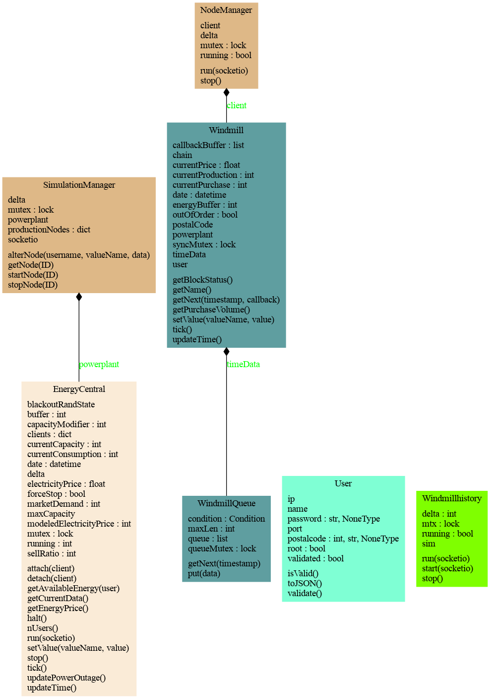

# M7011E Lab
Robin Danielsson and Oskar Havo

# Instruction for Audit
LUDD VM IP: 130.240.200.37

SSH settings: Default LUDD VPS settings.


We have added the public ssh key as requested. On our vm, we have placed usernames and passwords for audit in:
```
/home/robdan-7/AUDIT_INSTRUCTIONS.md
```
You should have access to this file with any user, otherwise please contact us.

## Deployment Protocol
To restart Server 
```
sudo su jenkins
export XDG_RUNTIME_DIR=/run/user/$(id -u)
systemctl --user restart flask
```

Alternatively, the python server can be started by executing:
```
python3 /var/lib/jenkins/workspace/M7011E-web/python/index.py
```
Note that the flask service must be turned off first. Replace **restart** with **stop**.

# Introduction
The purpose of this course was to create a simulator simulating a power grid. <br>
Where we have three main entities: Households, Windmills and Coal plants:
* Households are owned by users; they consume energy and gain energy from the windmills and powerplant. Houses in close by area codes also have similar wind patterns thus making their production levels similar.
* The Windmills simply produces energy and can break down randomly.
* The powerplant produces energy and is controlled by the admins. They serve all area codes, and its production is balanced over all users.


# Method
We have used Python Flask for our back-end. The web interface consists of html,css and javascript. We have used the server automation tool jenkins to easily build our application on each commit. We wanted to try Jenkns as it is an industry standard and it was recommended in class.

We have worked in an agile manner and divided work as equallly as possible.


# Result

## Design documentation
We have generated interactive documentation with doxygen. The index.html file can be found here [documentation](documentation/index.html).
Download the repository and take a look!

### Windmill
The windmill class is structured as an independent object and provides a tick function that updates the windmill 
state and stores the most recent data in a local FIFO queue. It also has and API access point for setting the sell and 
buy ratio, as well as blocking the sell ratio from being changed below 100%. Fetching data from a windmill is done by 
calling **getNext(timestamp,callback,callbackargs)**. This function retrieves a sublist from the FIFO queue containing all 
data samples with a more recent timestamp than what was provided in the function call. If a callback is provided, the 
variable will be put in a request buffer when no data can be retrieved and called upon the next windmill update sequence. As standard, 
the callback must accept a list of data points followed by a timestamp as arguments.

At every update, a windmill has a 1% chance of malfunction and will stop producing electricity. The power output will therefore stay at 0 and any 
provided power will either come from the buffer or energy central. Thereafter, it has a 5% chance to start producing electricity again. 
If a windmill can't produce any electricity, the wind speed will be reported as 0 because the engineer who designed the windmill connected 
the wind measuring equipment to the output of the turbine. This implementation flaw has been reported to the contractor and all concerned 
clients will receive windmill reparations during the second quarter of 2022.

Note that the windmill itself does not contain any code for maintaining an update cycle. This functionality left to be provided by 
the rest of the application/simulator.

#### Windmill update sequence


Each windmill maintains a consumption chain, which is a set of smaller components that together form a feedback loop where 
we calculate how much power that can be sold, purchased and stored in the buffer. Each square in the image above represents 
one of these components and provides information through generic **currentValue** functions. They also have a **tick** function 
that takes the required inputs anc calculates a new output that can then be used in the following components.

All updates are then executed from left to right, which means that we user the buffer output from the previous iteration and 
then use the new information to update the buffer.

### Energy central
The energy central class is more closely related to the simulator and does have a **run** function that updates the state at a fixed interval.
Here, the **tick** function is not meant to be called if the provided update function is running. 

The running state of the energy central is determined by an integer value from 0 to 10. A value of zero will halt the next update cycle and any value 
from 1 to 9 shows that the energy central is booting up. A value of 10 shows that the energy central is in fully working condition.

The available energy is divided equally between all active clients and is used to determine the market demand and modelled electricity price. 
At each update, there is a 1% chance that the connection to a client malfunctions which will stop any electricity from reaching that client 
and will instead be distributed to all other clients.

Clients must be registered to an Energy central to receive power. This is done by calling **attach(client)** followed by **detach(client)** to unregister. 
The energy central stores a dictionary of all clients and the power delivery status to them.

Data can be retrieved from the energy central at any moment by calling **getCurrentData()** and values can be set by calling **setValue(valueName, value)**. 

### Simulator
The simulator class maintains the energy central and all windmills. Upon starting a windmill, the simulator dispatches 
a new thread through the SocketIO API (using SocketIO through multiple threads requires this) that calls the update function 
of a windmill object and waits 10 seconds. The thread can then be shut down through the simulator.

The windmill implementation is therefore not dependent on the simulator once a thread has been started, and all windmills 
can operate asynchronously to each other and the energy central. It is also possible to deploy the simulator as 
a distributed system if a messaging protocol is added.

### Web server
The web server is made with Python Flask and provides request functions for html pages, as well as RESTful API calls. To invoke a specific 
REST function, one must first specify a website URL and then choose a REST function that is provided at that URL. We have 
done this in order to separate functionality between users and admins.

#### SocketIO streaming
Together with Flask, we have also set up SocketIO that provides bidirectional and low-latency communication between the server 
and it's clients. When a server-client connection is made, the client can only initiate a stream and determine if the stream 
should continue. Web clients do not determine the rate of the stream or when to receive data packets.

We have achieved this by buffering requests to windmill data if a windmill has not yet produced any. Client requests will 
therefore never block the server and cannot overload the bandwidth, which would be possible if the client could control the data flow. 
New data is then sent to the client whenever their windmill has updated, i.e. the streaming rate is determined 
by how frequently a windmill is updating its state.


## Design Diagram
### UML diagram for the main classes

### Package diagram that shows ownership/include paths


## API Specification
### Login ("/login")
Flask function for login page. On valid POST: Returns the admin or user home page, otherwise returns to the home page.

### Signup ("/signup") 
Flask function for signing up a user. On valid POST: Redirects to the user home page, otherwise returns to the signup page with an error.

### Settings ("/settings")
Flask function for changing user settings. On valid POST: Changes the requested user settings, otherwise redirects to the index page.

### Delete User ("/settings/delete")
Flask function for deleting a user. On valid POST: Deletes the logged in user and redirects to logout page, otherwise redirects to logout page.

### Image ("/image/\<usertype\>")
Flask function for fetching a user image. On valid POST: Sets the user image. On valid GET: Returns the user image if there is one.

usertype: Either "houseimage" or "admin".

### Fetch ("/fetch")
Legacy function. On valid GET: Fetches historical data for the logged in user. On valid PUT: Alters the user's windmill simulation instance with provided settings.

Valid windmill settings:
 - ValueName: "buyRatio", "sellRatio", "block".
 - data: Floating number 0-1 or None.

### Block User ("/block_user/\<username\>")
Flask function for blocking users. Will only work for verified admins. 

username: Name of the user to delete.

### Fetch Admin ("/fetch_admin")
Flask function for fetching information from the energy central object. Energy central data cannot be streamed and must be fetched on a per-package basis.
On valid GET: Returns central powerplant data. On valid PUT: Changes energy central settings.

Valid settings:
 - valueName: "sellRatio", "stop", "start", "powerplantproduction", "marketRatio", "currentelectricityprice"
 - data: Floating number 0-1 for sell and market ratio, integer for current electricity price or None for start and stop.

### Fetch All Users ("/fetch_all_users_for_admin") 
Flask function for retrieving information about all users in a html friendly format. On valid GET: Returns a Json structure containing all information of all users in the database.

### Start Stream (SocketIO "start stream")
SocketIO function for starting a windmill streaming session. Only works for valid regular users. A javascript function must be set up that handles "stream partition" events from SocketIO.

## Data Model Specification
We store user data in an SQL database that provides a table with username, hashed password, postal code, user image, 
root status, online status, login IP, login port and historical data. We have implemented a set of functions for interacting
with the database from python code, but there is no user authentication provided by these functions. 
It is up to the Flask server functions to authenticate users before editing user information, and the web server is 
the only point of access to the database.

Access to the current windmill data can only be done through the simulator, which we have placed in the same python program 
as the rest of the server. Flask provides the user with a few entry points for fetching and setting windmill status.


## Features and Design Choices.
In the images below you can see every task we have completed. All of the Logic ones and most of the user/admin ones. We 
chose not to do the "social" tasks, such as the chat, since we wanted to focus on the simulation part of this course. 
Below the images we go more into detail about our approach where necessary.


### Logic
#### Basic
***Automated Tests*** <br>
**Oskar & Robin** <br>
Every relevant backend function pertaining to the Mathematical Model is tested using Python Testing. We have focused on testing for every case in the mathematical model rather than testing every network component due to time constraints. 


***Mathematical Model*** <br>
**Oskar & Robin** <br>
The windmill production was to gradually change, and thus we use a sine wave function in order to create realistic wind patterns. Inorder to simulate geographical differences we have a different sine wave phase depending on the Area Code. This aims to simulate the wind patterns moving through the area at different times due to their geographical seperation. To simulate realistic weather patterns we also have a function determining the households power consumption based on the month, making it such that the consumption is lower in the summer time and higher during winter. The powerplant produces a set number of kWh which is then balanced out to give each house the same amount of base power. The windmills can also get broken down for a random number of days and the power plants can experience blackouts to certain area codes.

The price is calculated through having a base price and then adding/subtracting a simple demand/suply quota. We also have a function which uses the settable buy/sell ratios enabling the saving/selling of power.


***RESTful API*** <br>
**Robin** <br>
API functions are divided into different URLs for different functions, e.g. clients have a separate URL compared to administrators.
We use POST,PUT and GET commands in HTML and javascript, which communicate with flask's integrated requests solution.

#### Advanced

***Historical Data*** <br>
**Robin** <br>
Twice a day, the current status of all windmills are retrieved and stored in our sql database. Due to time constraints, we 
did not set up a separate time series database for this feature. However, at this scale our is more than sufficient.

Historical data can be viewed by the client in their dashboard alongside the graph for consumption and production.

***Locational Data*** <br>
**Oskar** <br>
Inorder to simulate geographical differences we have a different sine wave phase depending on the Area Code. This aims to 
simulate the wind patterns moving through the area at different times due to their geographical seperation.

***Modelling with Realistic Outdoor Weather*** <br>
**Oskar** <br>
To simulate realistic weather patterns we also have a function determining the households power consumption based on the month, 
making it such that the consumption is lower in the summer time and higher during winter.

***Realistic Wind Turbines*** <br>
**Oskar** <br>
The windmills can also get broken down. During this time the household only receives energy from the Power Plant and from its energy buffer.


### User
#### Basic

***Coal Powerplant Graphical Tools*** <br>
**Oskar** <br>
We have implemented gauges, sliders and graphs to allow the admin to visualize, manipulate and assess the energy data. 

***Controlling Ratio of Buying/Stored Energy*** <br>
**Oskar** <br>
By using using the sliders in the web interface you can control the ratio.

***Controlling Ratio of Selling/Storing Energy*** <br>
**Oskar** <br>
By using using the sliders in the web interface you can control the ratio.


***Login/Logout*** <br>
**Robin** <br>
The user provides username and password which POSTs and checks if this combiniation exists in the database, if so redirect to user dashboard.

***Upload House Photo*** <br>
**Robin** <br>
The user selects a photo from their device and uploads it, which POSTs the image and enters it to our database as a blob. It is then fetched from the databased and displayed in the uploaders dashboard.


***Viewable Data*** <br>
**Oskar** <br>
All the required data is displayed in raw form, graph form and most extensively in our gauges.

#### Advanced
***Account Deletion / Change Info*** <br>
**Oskar & Robin** <br>
We have a settings menu where you can change password and delete your user.


***Multiple Logins*** <br>
**Robin** <br>
This is done via sessions directly in flask. Flask provides a cookie which is encrypted with the server's password.


***Reorder Gauges with Drag and Drop*** <br>
**Oskar** <br>
We have implemented draggable gauges based on an example in order to easily visualize the data and to allow the user to change the order as it deems fit.

***User Friendly Data View (Gauges)*** <br>
**Oskar** <br>
We have implemented draggable gauges based on an example in order to easily visualize the data and to allow the user to change the order as it deems fit.


### Admin
#### Basic

***Account Deletion / Change Info of Other Users*** <br>
**Oskar & Robin** <br>
We have a settings menu where you can change password and delete your user. Using the Go To function in our prosumer table, 
the admin can easily switch to another user in order to change credentials and delete the user. The admin will always return 
to their own home page when logging out as another user.


***Coal Plant Energy Production Demand*** <br>
**Oskar** <br>
The Coal Plant Energy Production is displayed in one of our gauges.


***Coal Plant Status*** <br>
**Oskar & Robin** <br>
The Coal Plant Status is displayed in one of our gauges. When the simulation starts it will be "Starting" for 10 timesteps and then go to "Running".


***Electricity Price*** <br>
**Oskar** <br>
The electricity price can be set independently of the modelled electricity price. This price is then what is shown to the users.


***List of Prosumers*** <br>
**Oskar & Robin** <br>
The admin has a large table showing all users which allows for every action as requested.


***Market Demand*** <br>
**Oskar** <br>
The market demand is displayed in one of our gauges. It is calculated as described in the Mathematical Model section.


***Modelled Electricity Price*** <br>
**Oskar** <br>
The Modelled Electricity Price is displayed in one of our gauges. It is calculated as described in the Mathematical Model section.


***Ratio of Buffer/Market*** <br>
**Oskar** <br>
By using using the sliders in the web interface you can control the ratio.

***Users Effected By Blackout*** <br>
**Oskar & Robin** <br>
The admin can see in its prosumer table the blackout status of each user.


#### Advanced

***Coal Powerplant Graphical Tools*** <br>
**Oskar** <br>
We have implemented gauges, sliders and graphs to allow the admin to visualize, manipulate and assess the energy data. 

***IP and PORT Info*** <br>
**Oskar & Robin** <br>
The IP and PORT data is extracted from Flask and then displayed in the admins prosumer table.

***Real Time Data Stream*** <br>
**Robin** <br>
Real time data can be streamed from a user's windmill. Powerplant data can also be viewed by an admin.

***Reorder Gauges with Drag and Drop*** <br>
**Oskar** <br>
We have implemented draggable gauges based on an example in order to easily visualize the data and to allow the user to change the order as it deems fit.
The ordering is not stored between login sessions.


***Simulataneous Usage Across Different Devices*** <br>
**Robin** <br>
This is done via user sessions directly in flask. 


***Streaming Over Socket*** <br>
**Robin** <br>
We have chosen to use Socketio together with Flask to create a streaming service. The service uses the same user authentication 
as all other Flask functions and can handle multiple independent data streams. The frequency of streaming is determined by 
the update rate of windmills, not the rate of which the client sends requests to the server. I.e. the client only initiates 
a streaming session and responds to the server whenever it receives data packets, without knowing how much time has passed between requests.

If a client requests data from their windmill, the server will 
forward the request to the windmill which in turn checks if there is any new data to be returned based on the request timestamp.  If the timestamp 
is older than **n** data samples, the windmill will return all **n** samples to the client in a list. If no data samples can be returned, the request will be 
stored in a buffer until the next windmill update. Upon the next update sequence, all pending requests will be taken care of and sent back to the client(s).  


## Authentication Design
This is done via sessions directly in flask. Flask provides a cookie which is encrypted with a secret password stored in our 
database. We could generate a random value during runtime, but that would invalidate all our active sessions during testing 
when the flask server is restarted frequently. For a final production deployment, we would turn off this feature and use secure 
random values instead of a fixed data string.

To combat unauthorized access, we deserialize the session cookie into a Python object which can be checked for access rights.
This prevents normal users to access administrative content or spoofing invalid user logins. The object is then returned to the user 
in it's serialized form.

## Time Log
Robin Danielsson: ~107 Hours Total
<br>
Oskar Havo: ~101 Hours Total

# Conclusion

We have learned alot during this course. For instance how to create a substantial API which interacts with a database, server and users. We have also learned more about industry standards and how large scale deployment can be done.
